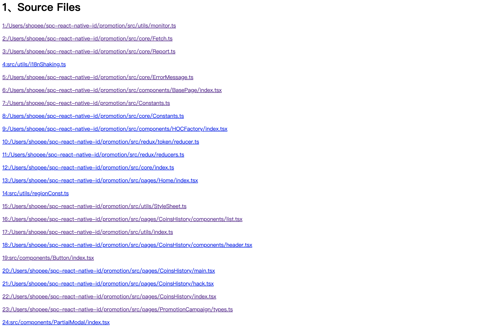

[[_TOC_]]

# i18n-shaking

i18n-shaking 是一个将 ES Module 项目中的多余的翻译 key 进行过滤，从而减少应用包体积的 Javascript 工具库。

- 与构建工具解耦: i18n-shaking 基于 TypeScript Compiler 的能力进行分析，完全与构建工具解耦，可应用在 Web（目前 Web 端仅支持 React）、React Native 项目中。
- 日志完善: i18n-shaking 提供了完整日志信息。包含所有解析的项目文件路径信息，以及对文件中无法进行静态的分析的翻译使用精确到行列信息的提示。用户第一次接入时可以更加方便快捷的进行人工辅助验证。

下面介绍下在项目中如何使用。

# 安装

## 全局安装

```
npm install i18n-shaking -g
```

## 项目内安装

```
npm install i18n-shaking -D
```

# 使用

在项目根目录下创建文件名为 ”i18nShaking.config.json“ 的文件，文件中配置项示例如下：

```json
{
  "entry": ["./src/index.tsx"],
  "output": "./output",
  "translateFileDirectoryPath": "./src/components/I18n",
  "translateFileNames": ["en.json", "vi.json", "th.json"],
  "pattern": [{ "name": "i18n", "path": "path" }],
  "frame": "react",
  "keyWhiteList": ["key1", "key2"]
}
```

如果为全局安装，则直接运行如下命令：

```
i18n-shaking
```

如果为局部安装，则在 ”package.json“ 文件中将命令注册为 npm 的 script：

```json
{
  "scripts": {
    "shaking": "i18n-shaking"
  }
}
```

注册之后，直接运行如下命令：

```
npm run shaking
```

如果你想查看运行日志，直接运行如下命令：

```
i18n-shaking --log
```

如果你想了解更多，直接运行如下命令：

```
i18n-shaking --help
```

# 配置项

## \*entry：项目入口文件

- 支持多入口，工具会从入口文件开始解析整个项目，并将 **node_modules** 中的模块以及项目中 **".d.ts"** 的类型声明文件过滤掉。目前工具仅支持 **ES Module** 项目。如果存在使用 **require** 加载 ES Module 的情况，建议全面替换为 ES Module 的形式，或者将 require 的 ES Module 文件手动添加到 **entry** 中。

## \*output：输出文件夹地址

- 文件夹必须存在，工具不会自动创建，否则前置校验会进行报错提示。目前不支持选填，如需覆盖读取文件，需手动配置为读取翻译文件路径。

## \*translateFileDirectoryPath：翻译文件所在文件夹地址

## \*translateFileNames：翻译文件夹路径下文件名集合

## \*pattern：匹配模式

- 数组集合，数组中每条模式包含 **name** 以及 **path** 两个属性，对应 ES Module 引入的模块名以及路径名，**name** 和 **path** 都可选填，所以可以组合出多种匹配模式，工具对每种匹配模式的处理也会略有不同：

* 填写 name 和 path，对引入路径以及模块名进行精准匹配。
* 只填写 name，不对引入模块的 path 做判断，只匹配引入模块名。
* 只填写 path，将所有通过该 path 引入的模块都视为翻译模块进行静态分析。

- 目前 path 仅支持配置路径与引入路径地址完全一致，所以适合于配置映射路径，后续会添加对于相对路径的支持。

## \*frame:项目框架

- 目前支持 **react** 或者 **react-native** 。

## keyWhiteList：翻译 key 白名单

- 如果存在翻译 key 并不能通过 **pattern** 配置进行静态分析得到。例如来自网络，或对多个翻译 key 额外进行封装的情况，可以将 key 手动添加至该白名单中。另外对于第二种手动封装翻译 key 的情况，可以通过函数进行标记，使得工具可以解析到，例子如下：

```javascript
// a.js
export const keys = {
   case1:"key1",
   case2:"key2"
}

// b.js
import {i18n,fetch} from 'other.module.js';
import {keys} from "a.js";

const case = fetch();

i18n.t(keys[case])
```

以上情况下，工具是无法完成静态分析的，但是我们可以添加一个函数来完成对这些翻译 key 的标记：

```javascript
// a.js
import {thisIsKey} from 'c.js';
export const keys = {
   case1:thisIsKey("key1"),
   case2:thisIsKey("key2")
}

// b.js
import {i18n,fetch} from 'other.module.js';
import {keys} from "a.js";

const case = fetch();

i18n.t(keys[case])

// c.js
export function thisIsKey(key:string){
   return key
}
```

如上，就完成了对于这些翻译 key 的函数标记,但是如果需要工具解析到，还需要将在 **pattern** 中添加一条匹配模式：

```json
{
  "pattern": [
    { "name": "i18n", "path": "path" },
    { "name": "thisIsKey", "path": "path" }
  ]
}
```

这样就可以对封装起来的 key 进行解析了。

# 日志信息

- 工具添加了 **--log** 参数，则在流程结束后启动本地服务，用户访问本地服务可以获取到工具运行报告。本地端口默认为**8888**，如果其他服务已经占用，默认会将日志输出至终端，考虑到终端阅读体验不佳，会对日志信息做精简处理。
  

- 访问服务，你可以得到如下一份运行报告，如 Contents 所示，报告共分为 **Source Files**、**Warnings**、**Source Files Info**、**Result** 四项。下面会对每一项作出解释。
  
- Source Files:工具解析到的项目文件（已经去除 node_modules 以及类型声明文件），点击每个文件可跳转查看详情信息。
  
- Warnings:对项目中无法进行静态分析的运行时变量做出提示，提示包含文件路径、行列信息、具体原因。
  
- Source Files Info:每个文件分析到的具体信息。包含分析到 key 以及无法分析的 warning 信息。
  
- Results: 工具最终分析结果，包含用户配置的 key 白名单、工具分析出的结果、实际输出的结果（若原翻译文件不存在 key，则实际输出会比分析出的要少）、分析结果相较于输出结果的差异。
  
  
  

# 开发

待完善
